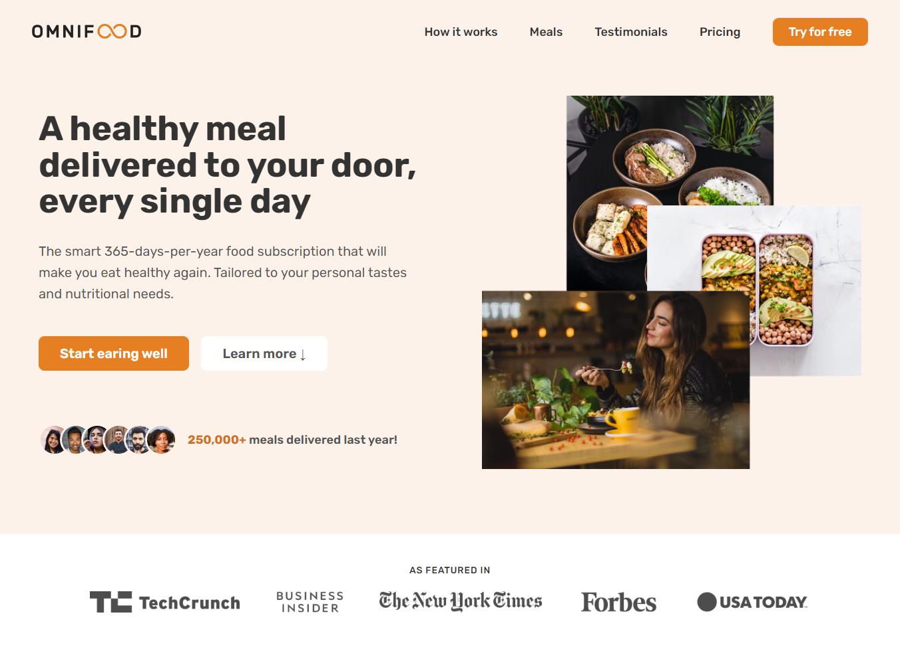
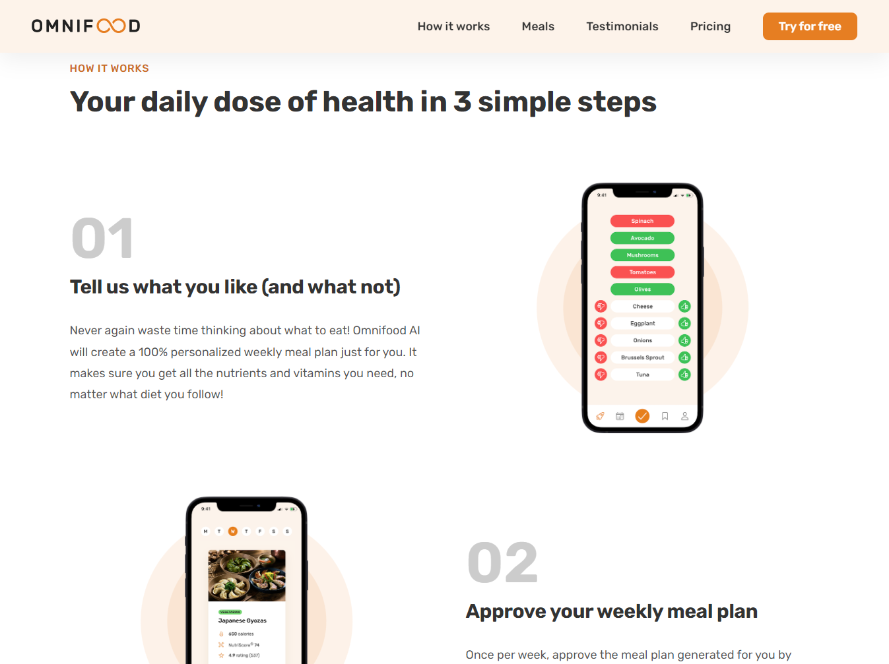
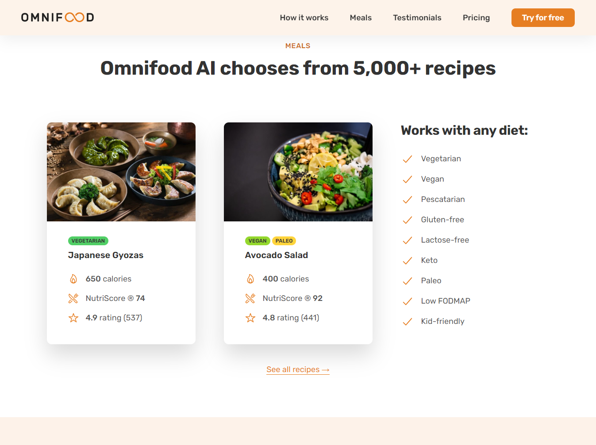
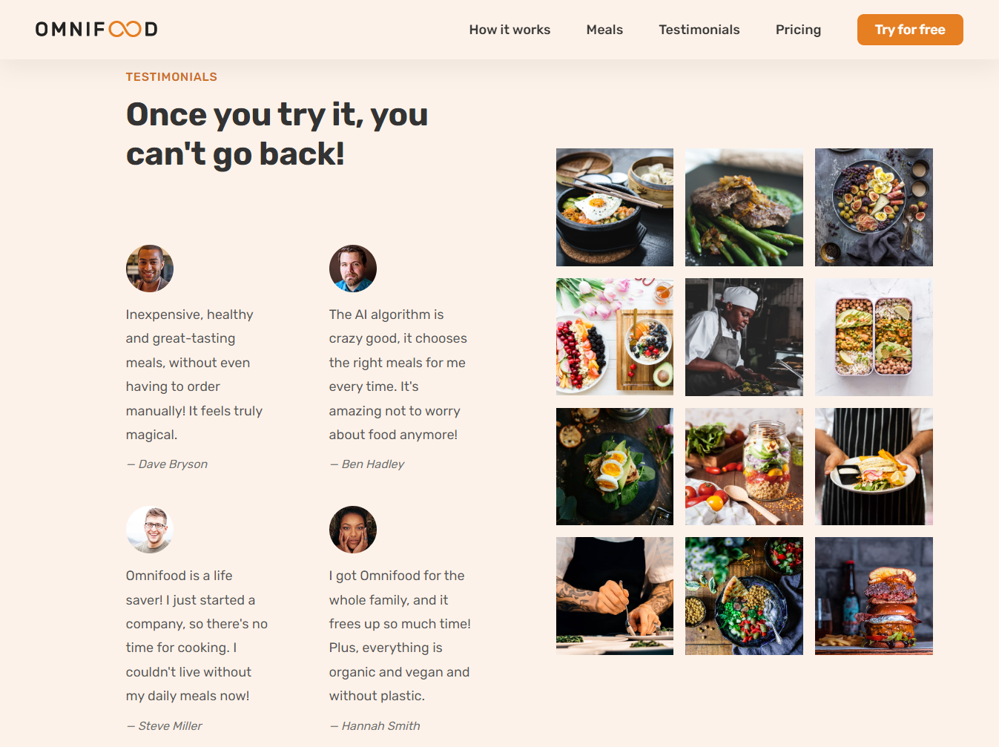

# Omnifood

   
  

  
  

> This project was built following the Udemy course "Build Responsive Real-World Websites with HTML and CSS" by Jonas Schmedtmann.

[🔗 Click here to access](https://emanuel-boaventura.github.io/nlw-esports-explorer/)

## 🛠 Techs

- HTML
- CSS
- JavaScript
- Git and Github

## 💛 Contact

- emanuelbmatos321@gmail.com
- [linkedin.com/in/emanuelboaventura](https://www.linkedin.com/in/emanuelboaventura/)
